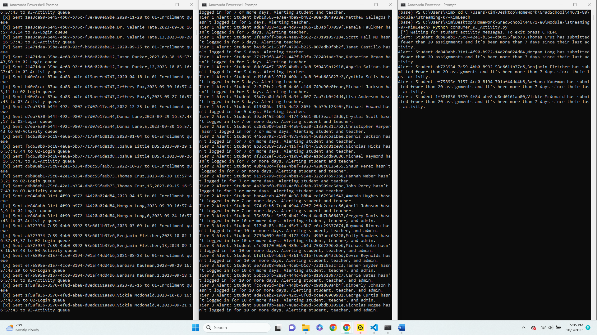
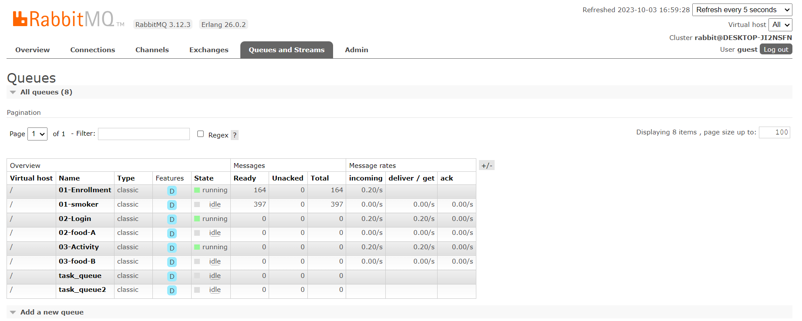
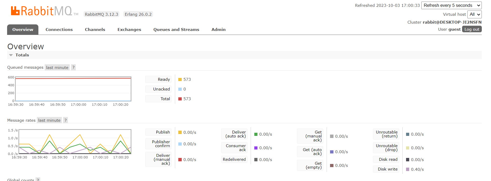

# Streaming Analytics Project
## Monitoring Student Activity in Online Courses

### Kim Leach
### October 03, 2023

---

### 📝 **Description**

In the era of online learning, it's essential to monitor student activities to ensure they are engaging with course materials. This project simulates the streaming of student activity data from a Learning Management System (LMS) like Canvas, enabling the set up of real-time alerts for educators based on student login and assignment submission activity.

#### Why this project?
Instructors and administrators need to be aware of students who might be falling behind or disengaging from the course. Early detection of such patterns allows for timely interventions, potentially aiding students in need.

---

### 📊 **Data Sources**

The student activity data is synthetically generated using the Python `Faker` library. While this is simulated data, it closely resembles what one might expect from an actual LMS. 

---

### 🔄 **Process**

#### Producers

- **`produce_student_data.py`**: Generates and streams synthetic student data to RabbitMQ. This includes student details, their last login time, total logins, assignment submission count, and last activity time.

#### Consumers

- **`consumer_02_login.py`**: Monitors the login queue. Generates alerts for students based on their last login time.
- **`consumer_03_activity.py`**: Observes the activity queue. Sends out notifications for students based on their assignment submission activity.

#### Exchanges & Queues

- **Exchanges**: This project uses the default exchange.
- **Queues**: 
  - **`01-Enrollment`**: Contains student enrollment data.
  - **`02-Login`**: Stores student login data and is used to monitor student login habits.
  - **`03-Activity`**: Contains data related to student assignment submissions.

---

### 📣 **Output**

The output of this simulation is alerts generated by the consumers. These alerts notify instructors and administrators about students who haven't logged in for a certain number of days or haven't been active in their assignment submissions. These could be modified as email or text alerts.

#### Results

- **Terminal Screenshots**: 
  

- **RabbitMQ Screenshots**: 
  
  

